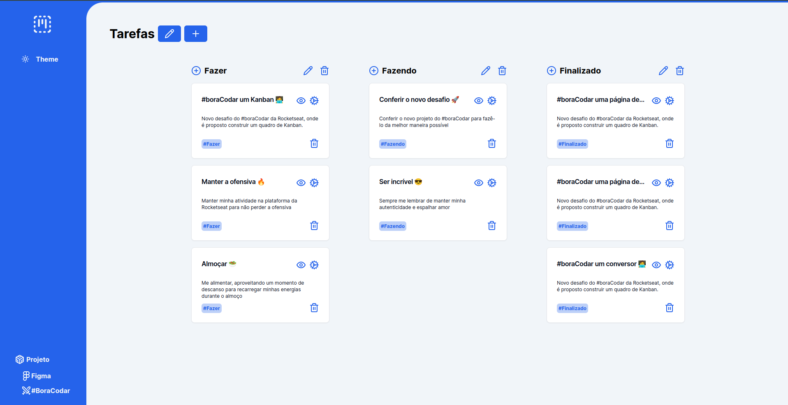

<h1 align="center">
    
   
</h1>

## Sobre

- Projeto desenvolvido a partir do desafio #boracodar disponível em: [#boracodar](https://www.rocketseat.com.br/boracodar), desafio 12, proposto pelo instrutor [Mayk Brito](https://www.youtube.com/@MaykBrito) da plataforma [Rocketseat](https://www.youtube.com/@rocketseat).

## Tecnologias

- [React](https://react.dev/)
- [NextJs](https://nextjs.org/)
- [TypeScript](https://www.typescriptlang.org/)
- [TailwindCss](https://tailwindcss.com/)
- [Shadcn UI](https://ui.shadcn.com/)
- [Lucide Icons](https://lucide.dev/)
- [Next-Themes](https://ui.shadcn.com/docs/dark-mode/next)

## Layout

- Você pode visualizar o layout deste projeto no figma através deste link [LINK](https://www.figma.com/community/file/1220368226816658013)

## Temas
### Como alterar as cores da aplicação. 
- As cores base desta aplicação são do shadcn ui. 
- Para alterar acesse a página de [TEMAS](https://ui.shadcn.com/themes) no shadcn ui.
- Clique em "Costomize" e selecione a cor desejada, depois em "Copy Code".
- Copie as novas variáveis CSS disponíveis.
- Substitua as variáveis no aquivo "globals.css" o trecho correspondente ao código copiado (@layer Base)

## Download
### Clone o repositório do Github

